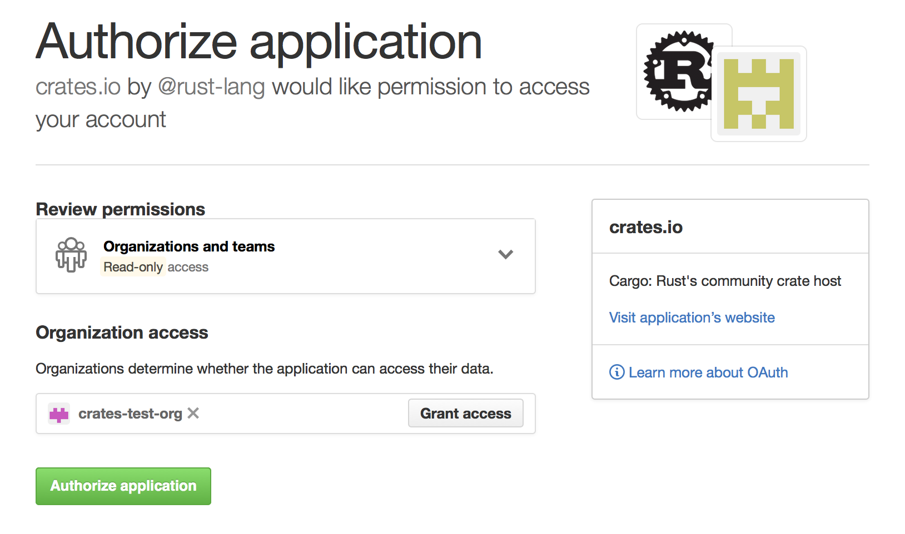

## Publishing on crates.io

一旦你有了一个你想和全世界分享的图书馆,是时候发布它了.[克拉西奥.]!发布一个箱是当一个特定的版本上载[克拉西奥.].

发布箱时要小心,因为发布是**永久的**. 无法重写版本,无法删除代码.然而,可以出版的版本数量没有限制.

### Before your first publish

首先,你需要一个帐户[克拉西奥.]获取API令牌.这样做,[访问主页][crates.io]并通过GITHUB帐户登录(现在需要).在此之后,访问您的[Account
Settings](https://crates.io/me)页面运行`cargo login`命令指定.

```notrust
$ cargo login abcdefghijklmnopqrstuvwxyz012345
```

此命令将通知您的API令牌的货物并将其本地存储在您的`~/.cargo/config`. 注意,这个标记是**秘密**不应该和任何人分享.如果它泄漏任何原因,你应该立即再生它.

### Before publishing a new crate

记住箱子上的名字[克拉西奥.]按先到先得方式分配.一旦一个箱子名称被拿走,它不能用于另一个板条箱.

#### Packaging a crate

下一步是把你的箱子包装成一个可以上传到的格式.[克拉西奥.]. 为此,我们将使用`cargo package`子命令.这将把我们的整个箱子包装成一个`*.crate`文件中`target/package`目录.

```notrust
$ cargo package
```

作为额外的奖励,`*.crate`将独立于当前源树进行验证.后`*.crate`被创建,它被解压缩成`target/package`然后从头开始构建,以确保所有必要的文件都用于构建成功.可以禁用此行为.`--no-verify`旗帜.

现在是时候看看`*.crate`确保您没有意外地打包2GB视频资产或用于代码生成、集成测试或基准测试的大型数据文件.目前有10MB上传大小限制`*.crate`文件夹.所以,如果大小`tests`和`benches`目录及其依赖关系最多有几MB,您可以将它们保存在包中;否则,最好将它们排除在外.

在打包时,Cargo将自动忽略版本控制系统忽略的文件,但如果您希望指定要忽略的额外文件集,则可以使用`exclude`清单中的关键字:

```toml
[package]
# ...
exclude = [
    "public/assets/*",
    "videos/*",
]
```

这个数组中每个元素的语法是什么[rust-lang/glob](https://github.com/rust-lang/glob)接受.如果你宁愿用白名单而不是黑名单,货物也支持一个`include`键,如果设置,则重写`exclude`关键:

```toml
[package]
# ...
include = [
    "**/*.rs",
    "Cargo.toml",
]
```

### Uploading the crate

现在我们有了`*.crate`文件准备就绪,可以上传到[克拉西奥.]与`cargo publish`命令.就是这样,你已经出版了你的第一个板条箱!

```notrust
$ cargo publish
```

如果你想跳过`cargo package`步骤`cargo publish`如果没有找到一个副本,子命令将自动打包本地机箱.

一定要检查一下[metadata you can
specify](03-02-manifest.html#package-metadata)确保你的箱子更容易被发现!

### Publishing a new version of an existing crate

若要发布新版本,请更改`version`您指定的值`Cargo.toml`显示.牢记[the semver
rules](03-02-manifest.html#the-version-field). 然后选择运行`cargo package`如果你想检查`*.crate`在发布之前为新版本文件,并运行`cargo publish`上传新版本.

### Managing a crates.io-based crate

板条箱的管理主要是通过命令行完成的.`cargo`工具而不是[克拉西奥.]Web界面.为此,有几个子命令来管理板条箱.

#### `cargo yank`

的场合可能出现你发布一个版本的板条箱,实际上最终被打破或其他的原因之一(语法错误,忘了还有一个文件,等).对于这样的情况,货物支持一个板条箱的"YANK".

```notrust
$ cargo yank --vers 1.0.1
$ cargo yank --vers 1.0.1 --undo
```

猛禽**不**删除任何代码.例如,此功能不用于删除意外上传的机密.如果发生这种情况,你必须立即重置这些秘密.

一个拉版的语义是没有新的依赖关系可以被创建在这一版本,但都存在依赖关系继续工作.主要目标之一[克拉西奥.]作为包装箱,不随时间变化的永久档案,并允许一个版本的缺失会对这一目标.本质上,YANK意味着所有的项目都有`Cargo.lock`不会打破,而未来`Cargo.lock`生成的文件不会列出猛增版本.

#### `cargo owner`

板条箱通常是由不止一个人开发的,或者主要的维护者会随着时间的推移而改变!一个箱子的主人是唯一一个允许发布的板条箱的新版本,但业主可以指定其他业主.

```notrust
$ cargo owner --add my-buddy
$ cargo owner --remove my-buddy
$ cargo owner --add github:rust-lang:owners
$ cargo owner --remove github:rust-lang:owners
```

给予这些命令的所有者ID必须是GITHUB用户名或GITHUB团队.

如果提供用户名`--add`那个用户变成了一个"被命名"的拥有者.除了能够发布或翻转机箱版本,它们还具有添加或删除所有者的能力,*包括*制作的主人*他们*拥有者.不用说,你不应该让人们对一个具名的主人不完全信任.为了成为命名所有者,用户必须登录到[克拉西奥.]以前.

如果给出团队名称`--add`这个团队变成了"团队"的拥有者,对板条箱有限制的权利.当他们有权发布或强行的版本的板条箱,他们*不*有能力添加或删除业主.除了更方便地管理所有者组之外,团队对于所有者恶意攻击也更加安全.

当前团队的语法`github:org:team`(见上面的例子).为了增加一个团队作为所有者,必须是团队的一员.没有这样的限制适用于作为所有者的团队的移除.

### GitHub permissions

GitHub不提供简单的公共访问权限,并且您在与团队成员一起工作时可能会遇到以下消息:

> 看起来您没有权限从GITHUB查询必要的属性来完成这个请求.您可能需要重新进行身份验证.[克拉西奥.]授予准许读取GITHUB ORG成员资格.只要去<https://crates.io/login>

这基本上是"您试图查询一个团队,而五个级别的成员访问控制之一拒绝这样做"的万能方法.这不是夸张.GITHUB对团队访问控制的支持是企业级的.

最可能的原因是,在添加该特性之前,您上次登录.我们最初要求*不*在验证用户时来自GitHub的权限,因为我们实际上除了登录用户之外从未使用过用户的令牌.然而,为了代表您的团队成员资格,我们现在需要[the `read:org` scope](https://developer.github.com/v3/oauth/#scopes).

你可以自由地拒绝我们这个范围,在团队介绍之前工作的一切都会继续工作.然而,你永远无法添加一个团队作为一个所有者,或发布一个板条作为一个团队拥有者.如果你曾经试图这样做,你会得到上面的错误.如果你试图发布一个你根本不拥有的板条箱,你可能也会看到这个错误,但是在其他情况下会有一个团队.

如果你改变主意,或者只是不确定是否[克拉西奥.]有足够的权限,你可以随时去<https://crates.io/login>这将提示您是否允许[克拉西奥.]没有它想要的所有范围.

查询GITHUB的另一个障碍是组织可能主动拒绝第三方访问.要检查这个,你可以去:

```
https://github.com/organizations/:org/settings/oauth_application_policy
```

在哪里?`:org`是组织的名称(例如锈郎).你可能会看到一些类似的事情:


您可以选择显式移除[克拉西奥.]从组织的黑名单中,或者简单地按下"删除限制"按钮,允许所有第三方应用程序访问此数据.

或者,何时[克拉西奥.]请求`read:org`范围内,可以显式白名单.[克拉西奥.]通过按其名称旁边的"授予访问"按钮来查询问题中的ORG:



[crates.io]: https://crates.io/
